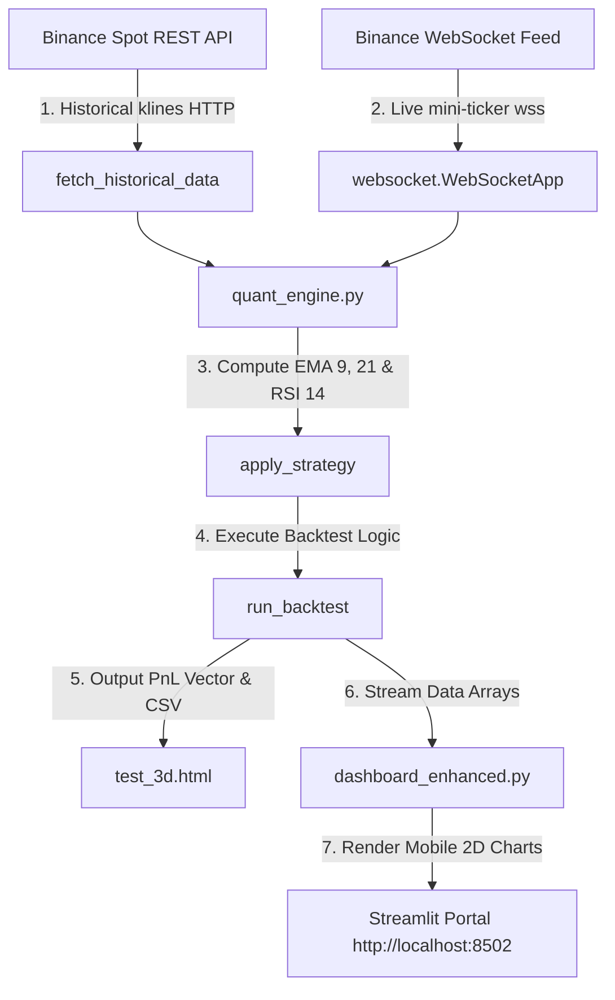
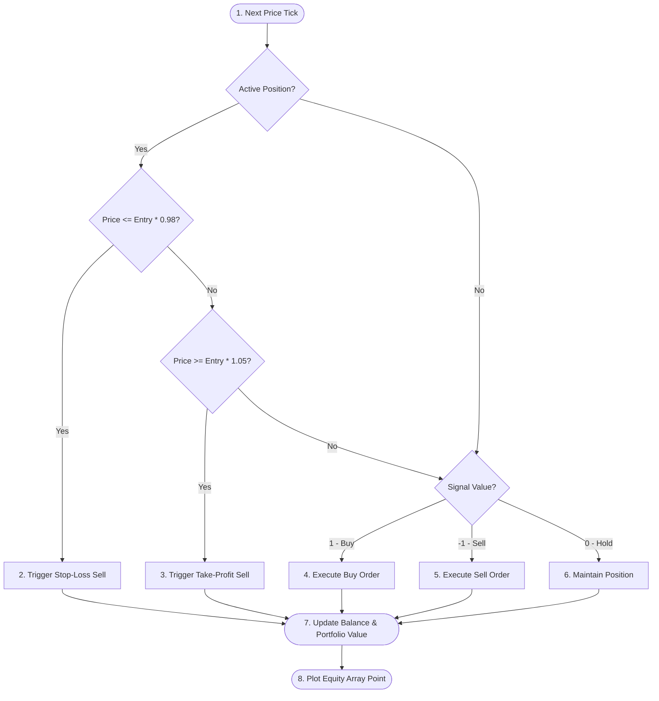

# <div align="center">AETHER QUANT</div>

<!-- MOBILE-FRIENDLY FLAT 2D DASHBOARD TELEMETRY BANNER -->
<div align="center">
  <svg width="100%" max-width="850px" height="240px" viewBox="0 0 850 240" fill="none" xmlns="http://www.w3.org/2000/svg" style="background: #070709; border-radius: 12px; border: 1px solid #1E2030; box-shadow: 0 10px 30px rgba(0,0,0,0.55);">
    <!-- Background Gradient -->
    <rect width="850" height="240" rx="12" fill="url(#bg_gradient)" />
    <!-- Fine Telemetry Grid -->
    <rect width="850" height="240" rx="12" fill="url(#telemetry_grid)" opacity="0.3" />
    
    <defs>
      <linearGradient id="bg_gradient" x1="0" y1="0" x2="850" y2="240" gradientUnits="userSpaceOnUse">
        <stop offset="0%" stop-color="#070510"/>
        <stop offset="50%" stop-color="#0B0C16"/>
        <stop offset="100%" stop-color="#030305"/>
      </linearGradient>
      <linearGradient id="cyan_neon_line" x1="0" y1="0" x2="850" y2="0" gradientUnits="userSpaceOnUse">
        <stop offset="0%" stop-color="#00D2FF"/>
        <stop offset="50%" stop-color="#00FFA3"/>
        <stop offset="100%" stop-color="#BD00FF"/>
      </linearGradient>
      <pattern id="telemetry_grid" width="25" height="25" patternUnits="userSpaceOnUse">
        <path d="M 25 0 L 0 0 0 25" fill="none" stroke="#222538" stroke-width="0.5"/>
      </pattern>
      <!-- Glow Filters -->
      <filter id="glow_cyan" x="-20%" y="-20%" width="140%" height="140%">
        <feGaussianBlur stdDeviation="4" result="blur" />
        <feMerge>
          <feMergeNode in="blur" />
          <feMergeNode in="SourceGraphic" />
        </feMerge>
      </filter>
      <filter id="glow_green" x="-30%" y="-30%" width="160%" height="160%">
        <feGaussianBlur stdDeviation="6" result="blur" />
        <feMerge>
          <feMergeNode in="blur" />
          <feMergeNode in="SourceGraphic" />
        </feMerge>
      </filter>
      <filter id="glow_red" x="-30%" y="-30%" width="160%" height="160%">
        <feGaussianBlur stdDeviation="6" result="blur" />
        <feMerge>
          <feMergeNode in="blur" />
          <feMergeNode in="SourceGraphic" />
        </feMerge>
      </filter>
    </defs>

    <!-- 2D Telemetry Line Chart -->
    <path d="M 50 170 Q 200 60 380 145 T 700 90" stroke="url(#cyan_neon_line)" stroke-width="3" stroke-linecap="round" fill="none" filter="url(#glow_cyan)" />
    
    <!-- 2D Indicator Nodes -->
    <!-- Buy Node -->
    <circle cx="218" cy="98" r="7" fill="#00FFA3" filter="url(#glow_green)" />
    <circle cx="218" cy="98" r="3" fill="#FFFFFF" />
    <text x="218" y="80" fill="#00FFA3" font-family="system-ui, sans-serif" font-weight="bold" font-size="9" text-anchor="middle" letter-spacing="0.5">🟢 BUY</text>

    <!-- Sell Node -->
    <circle cx="482" cy="115" r="7" fill="#FF0055" filter="url(#glow_red)" />
    <circle cx="482" cy="115" r="3" fill="#FFFFFF" />
    <text x="482" y="97" fill="#FF0055" font-family="system-ui, sans-serif" font-weight="bold" font-size="9" text-anchor="middle" letter-spacing="0.5">🔴 SELL</text>

    <!-- UI Telemetry Details -->
    <rect x="30" y="20" width="110" height="18" rx="3" fill="#10111A" stroke="#25283D" stroke-width="0.75"/>
    <circle cx="40" cy="29" r="2.5" fill="#00FFA3" />
    <text x="48" y="32" fill="#8F94B5" font-family="monospace" font-size="8.5">LIVE STREAM</text>

    <rect x="710" y="20" width="110" height="18" rx="3" fill="#10111A" stroke="#25283D" stroke-width="0.75"/>
    <text x="765" y="32" fill="#00D2FF" font-family="monospace" font-size="8.5" text-anchor="middle">ENGINE: ACTIVE</text>

    <!-- Title and Subtitle -->
    <text x="425" y="55" fill="#FFFFFF" font-family="system-ui, sans-serif" font-weight="900" font-size="26" text-anchor="middle" letter-spacing="10" filter="url(#glow_cyan)">AETHER QUANT</text>
    <text x="425" y="73" fill="#00D2FF" font-family="system-ui, sans-serif" font-weight="600" font-size="10" text-anchor="middle" letter-spacing="2" opacity="0.95">PORTABLE 2D ALGORITHMIC TELEMETRY PLATFORM</text>
  </svg>
</div>

<br>

<div align="center">

  <!-- PLATFORM BADGES -->
  
  
  
  
  

</div>

---

### 🧠 Core Strategy & Telemetry Solution

#### 1. The Quantitative Strategy
At the heart of **Aether Quant** is an adaptive **Exponential Moving Average (EMA) Trend Crossover model** integrated with a **Relative Strength Index (RSI) Momentum Filter** to prevent false breakout entries.
* **Trend Inception (EMA 9 & 21)**: The system tracks the exponential moving average of recent close values to isolate structural trend directions. A crossover of the fast 9-period EMA above the slow 21-period EMA indicates potential upward price expansion.
* **Momentum Confirmation (RSI 14)**: To eliminate false breakouts common to moving averages in range-bound markets, the engine overlays an RSI oscillator. Buy triggers are strictly locked to high-probability oversold regions ($\text{RSI} < 30$), and exit signals are executed at overbought zones ($\text{RSI} > 70$).
* **Risk Protocol Layer**: Every trade is instantly protected with a hard **2.0% Stop-Loss** safety buffer to limit downside risk and a **5.0% Take-Profit** target boundary to automatically lock in gains.

#### 2. The Telemetry Solution (High-Performance 2D Layout)
* **The Problem**: High-end 3D graphics and complex WebGL meshes can be heavy and incompatible with many mobile devices (such as Redmi phones), resulting in slow rendering and layout breakage.
* **The Solution**: **Aether Quant** uses a clean, responsive, and robust **2.0D and 2D charting pipeline**. It visualizes multi-indicator relationships and backtest results using lightweight, mobile-responsive vector charts that render instantly on any smartphone viewport.

#### 3. Real-Time Data Ingestion Channels
* **Historical & Backtest Feeds**: Fetched directly from the **Binance Spot REST API** (`https://api.binance.com`) using optimized request limits to build structured data tables and generate offline backtesting metrics.
* **Live Streaming Telemetry**: Connected dynamically via low-latency WebSockets directly to the official **Binance Ticker Feed** (`wss://stream.binance.com:9443/ws/btcusdt@ticker`), streaming sub-second market updates directly into the system telemetry grid.

---

### 📈 Core 2D Quantitative Analytics & Chart Suite

The platform utilizes a robust, mobile-optimized 2D plotting suite built with Plotly and Streamlit. This guarantees smooth interactions on mobile web browsers:

#### 1. Primary Asset Price Chart & Trend Bands
* **Visualizes**: Live asset price action plotted against fast ($\text{EMA}_9$) and slow ($\text{EMA}_{21}$) moving averages.
* **Telemetry Markers**: Injects dynamic 2D markers directly onto the price line at exact signal timestamps—glowing green circles for active buy positions and crimson "x" marks for liquidated trade states.

#### 2. Volumetric Equity Curve (Account Balance Tracking)
* **Visualizes**: Cumulative portfolio net asset value (NAV) tracked across backtest intervals.
* **Details**: Shows account growth starting from the baseline **`$10,000`** capital, with a dotted reference line marking the starting capital to evaluate net performance.

#### 3. RSI Momentum Bands
* **Visualizes**: Oscillator values plotted on a bounded range of $0$ to $100$.
* **Boundary Zones**: Shaded bands show the oversold zone ($<30$, green fill) and overbought zone ($>70$, red fill). This helps traders see how closely entries align with momentum extremes.

---

### ⚙️ Platform Technical Architecture

To keep the repository easily understandable and portable, the operational architecture and logic transitions are mapped out below:

#### 1. System Telemetry & Data Ingestion Flow
This architecture illustrates how raw market data flows from Binance API and WebSocket channels down into the vector calculation engine and resolves into your dashboard:



#### 2. Backtesting Decision & Risk Management Loop
This blueprint maps the state transitions used at each time-series interval to manage trade states and protect trading capital:



---

### 📂 Repository Blueprint & Components

```
.
├── quant_engine.py             # 🧮 Core math engine: fetches API data, calculates EMA/RSI, runs backtests
├── dashboard_enhanced.py      # 🚀 Enhanced dashboard: houses the mobile-friendly 2D visualizations and guide
├── dashboard.py               # 📈 Standard lightweight dashboard deployment
├── live_stream.py             # 🔌 WebSocket connector for real-time market data
├── test_3d.html               # 🖥️ Compiled standalone dashboard file (contains pre-rendered vector plots)
├── run_dashboard.bat          # ⚡ One-click launcher script for Windows developers
├── requirements.txt           # 📦 Dependency manifest
├── LICENSE                    # 📄 MIT Open Source License
└── README.md                  # 🌌 Futuristic technical overview
```

---

### 🚀 Production Deployment & Installation

Follow these steps to set up the system environment and launch the dynamic analytics telemetry.

#### 1. Pre-requisites & Core Environment Setup
Ensure Python 3.8+ is installed on your workstation:

```bash
# Clone the repository
git clone https://github.com/P-mohith230/aether-3d-quant--EMA-RSI--Strategy.git

# Navigate into the project directory
cd aether-3d-quant--EMA-RSI--Strategy

# Install requirements
pip install -r requirements.txt
```

#### 2. Run the Quantitative Backtest Engine (Command-Line)
Run the backtesting module in the terminal to execute calculations:

```bash
python quant_engine.py
```
*Expected Terminal Telemetry:*
```
### FETCHING SYSTEM DATA FROM BINANCE API...
### RUNNING HISTORICAL BACKTEST ON BTCUSDT...
Backtest complete. Total Profit: -$428.27
```

#### 3. Launch the Telemetry Dashboard
Start the local server. The dashboard will automatically launch in your browser:

```bash
# Launch via Python interpreter (robust Windows fallback)
python -m streamlit run dashboard_enhanced.py
```
*Windows developer shortcut:*
```bash
# Run via bat launcher
run_dashboard.bat
```

#### 4. Stream Live Market Data via WebSockets
To test real-time data streaming from Binance tickers directly to your console, run:

```bash
python live_stream.py
```

---

### 🗺️ Future Roadmap

```
  PHASE 1: MOBILE OPTIMIZATION ────────────────────────► Completed
  • Responsive 2D layouts and custom vector blueprints.
  • Strategy state transition logic mapped in Mermaid.

  PHASE 2: STRATEGY EXTENSION ────────────────────────► In Progress
  • Incorporate additional indicators (MACD crossovers, Volatility squeeze).
  • dynamic multi-timeframe evaluation models.

  PHASE 3: HIGH-FREQUENCY PIPELINES ──────────────────► Planning
  • Low-latency WebSocket integration directly feeding live 2D charts.
  • Multi-exchange order-book telemetry streams.
```

---

### 👥 Contribution & Guidelines

AETHER Quant is an open-source research initiative. We welcome enhancements to our quantitative models:
1. **Fork the Repository** to your workspace.
2. **Implement enhancements** (such as custom indicators, alternative strategies, or 2D visualizations).
3. **Submit a Pull Request** with detailed documentation of your math engine changes.

---

### 📄 License Compliance

This project is officially released under the **MIT License**. It grants full permissions for modification, distribution, and commercial applications, provided the original copyright is kept.

> [!CAUTION]
> **Financial Disclaimer**: Algorithmic trading involves substantial risk of loss. The strategy and analytics displayed by AETHER Quant are designed for academic, research, and educational purposes only. Past backtesting performance does not guarantee future results.

---

<div align="center">
  <sub>Developed by <b>pagad</b> | Powered by Python, Plotly &amp; Streamlit</sub>
</div>
